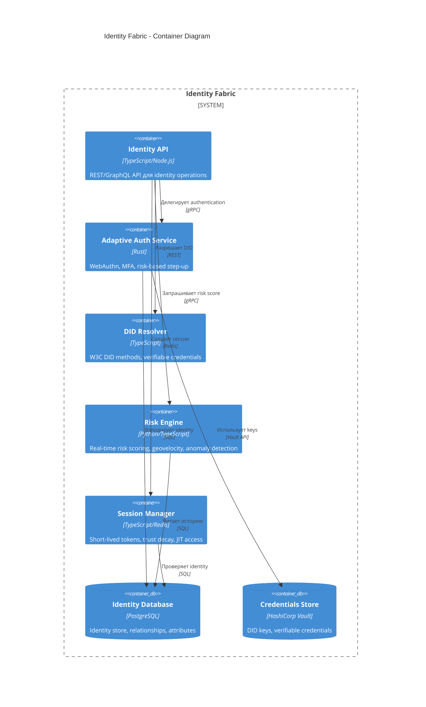
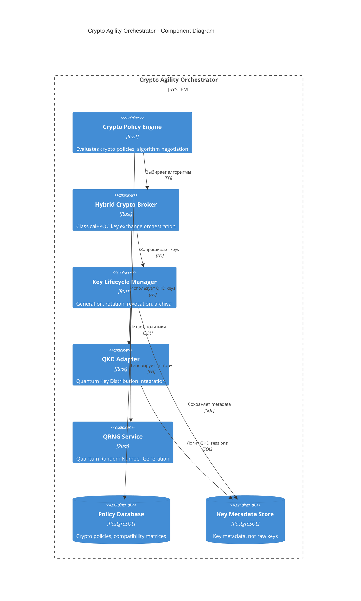

# 🚀 PROTOCOL SECURITY ARCHITECTURE 3.0
## PHASE 2: ENGINEERING BLUEPRINT

**Версия:** 3.0.0-alpha  
**Дата:** 23 марта 2026  
**Статус:** Production Blueprint Ready

---

# ЧАСТЬ 1: C4 МОДЕЛЬ АРХИТЕКТУРЫ

## 1.1 Context Diagram (Level 1)

```mermaid
C4Context
    title Protocol Security Architecture 3.0 - System Context

    Person(admin, "Security Admin", "Управляет политиками безопасности и инцидентами")
    Person(developer, "Developer", "Интегрирует security SDK в приложения")
    Person(analyst, "SOC Analyst", "Мониторит угрозы и реагирует на инциденты")
    Person(auditor, "Auditor", "Проверяет compliance и получает evidence")

    System_Boundary(protocol, "Protocol Security 3.0") {
        Container(api_gw, "Security API Gateway", "TypeScript/Node.js", "Единая точка входа, WAF, rate limiting, auth")
        Container(identity, "Identity Fabric", "TypeScript/Rust", "Human/Workload/Device identity, DID, adaptive auth")
        Container(crypto, "Crypto Agility Plane", "Rust/TypeScript", "PQC, hybrid crypto, HSM, QKD, FHE orchestration")
        Container(mesh, "Service Mesh Security", "Go/Rust", "mTLS, OPA, SPIFFE, eBPF monitoring")
        Container(ai, "AI Security Cognition", "Python/TypeScript", "LLM analyst, UEBA, predictive threat intel")
        Container(soar, "Autonomous SOAR", "TypeScript", "Playbook execution, ChatOps, approval workflows")
        Container(compliance, "Compliance Engine", "TypeScript", "Continuous control monitoring, 25+ frameworks")
        Container(integrity, "Integrity & Trust", "Rust/TypeScript", "Immutable audit log, blockchain anchor, Rekor")
        Container(data, "Security Data Platform", "Kafka/ClickHouse/Graph", "Event streaming, lakehouse, feature store")
    }

    System_Ext(apps, "Business Applications", "Приложения которые защищаем")
    System_Ext(cloud, "Cloud Providers", "AWS/Azure/GCP", "Multi-cloud infrastructure")
    System_Ext(cti, "Threat Intel Sources", "STIX/TAXII, ISAC, Dark Web", "Внешние источники угроз")
    System_Ext(legal, "Legal/Compliance", "Регуляторы, аудиторы", "GDPR, PCI DSS, HIPAA и т.д.")

    Rel(admin, api_gw, "Управляет через", "HTTPS/GraphQL")
    Rel(developer, api_gw, "Интегрирует SDK", "REST/gRPC")
    Rel(analyst, ai, "Использует для", "Threat hunting")
    Rel(analyst, soar, "Запускает playbooks", "ChatOps")
    Rel(auditor, compliance, "Получает reports", "PDF/JSON")
    Rel(auditor, integrity, "Проверяет evidence", "Blockchain proofs")

    Rel(api_gw, identity, "Валидирует identity", "mTLS")
    Rel(api_gw, crypto, "Запрашивает crypto policy", "gRPC")
    Rel(identity, crypto, "Использует для", "Key derivation")
    Rel(crypto, mesh, "Обеспечивает", "Quantum-safe mTLS")
    Rel(mesh, data, "Стримит telemetry", "Kafka")
    Rel(ai, data, "Анализирует", "Feature store")
    Rel(soar, ai, "Получает рекомендации", "LLM inference")
    Rel(compliance, data, "Собирает evidence", "SQL/GraphQL")
    Rel(integrity, data, "Анchorит в blockchain", "Polygon/Enterprise chain")

    Rel(apps, api_gw, "Защищается через", "HTTPS")
    Rel(cloud, crypto, "Предоставляет HSM/KMS", "Cloud API")
    Rel(cti, ai, "Поставляет intelligence", "STIX/TAXII")
    Rel(compliance, legal, "Соответствует", "Frameworks mapping")

    UpdateLayoutConfig($c4ShapeInRow="4", $c4BoundaryInRow="1")
```



## 1.2 Container Diagram (Level 2) - Identity Fabric



## 1.3 Component Diagram (Level 3) - Crypto Agility Orchestrator



---

# ЧАСТЬ 2: OPENAPI SPECIFICATIONS

## 2.1 Crypto Agility API v3

```yaml
openapi: 3.1.0
info:
  title: Protocol Security - Crypto Agility API
  description: |
    Quantum-resistant cryptographic operations with hybrid classical+PQC support.
    Supports NIST-selected algorithms: Kyber, Dilithium, FALCON, SPHINCS+.
  version: 3.0.0
  contact:
    name: Protocol Security Team
    email: security@protocol.local
  license:
    name: MIT
    url: https://opensource.org/licenses/MIT

servers:
  - url: https://api.protocol.local/v3/crypto
    description: Production
  - url: https://staging-api.protocol.local/v3/crypto
    description: Staging

tags:
  - name: Hybrid Encryption
    description: Classical + PQC hybrid cryptographic operations
  - name: Policy Evaluation
    description: Crypto policy negotiation and evaluation
  - name: Key Management
    description: Key lifecycle operations (metadata only)
  - name: QKD Integration
    description: Quantum Key Distribution adapters

paths:
  /hybrid-encrypt:
    post:
      tags:
        - Hybrid Encryption
      summary: Encrypt data using hybrid classical+PQC scheme
      operationId: hybridEncrypt
      requestBody:
        required: true
        content:
          application/json:
            schema:
              $ref: '#/components/schemas/HybridEncryptRequest'
      responses:
        '200':
          description: Successfully encrypted
          content:
            application/json:
              schema:
                $ref: '#/components/schemas/HybridEncryptResponse'
        '400':
          description: Invalid request
          content:
            application/json:
              schema:
                $ref: '#/components/schemas/Error'
        '422':
          description: Crypto policy violation
          content:
            application/json:
              schema:
                $ref: '#/components/schemas/CryptoPolicyError'

  /hybrid-decrypt:
    post:
      tags:
        - Hybrid Encryption
      summary: Decrypt data using hybrid classical+PQC scheme
      operationId: hybridDecrypt
      requestBody:
        required: true
        content:
          application/json:
            schema:
              $ref: '#/components/schemas/HybridDecryptRequest'
      responses:
        '200':
          description: Successfully decrypted
          content:
            application/json:
              schema:
                $ref: '#/components/schemas/HybridDecryptResponse'
        '400':
          description: Invalid ciphertext
        '403':
          description: Key access denied

  /policy/evaluate:
    post:
      tags:
        - Policy Evaluation
      summary: Evaluate crypto policy for a transaction
      operationId: evaluateCryptoPolicy
      requestBody:
        required: true
        content:
          application/json:
            schema:
              $ref: '#/components/schemas/PolicyEvaluationRequest'
      responses:
        '200':
          description: Policy evaluation result
          content:
            application/json:
              schema:
                $ref: '#/components/schemas/PolicyEvaluationResponse'

  /policy/algorithms:
    get:
      tags:
        - Policy Evaluation
      summary: List supported algorithms by category
      operationId: listSupportedAlgorithms
      parameters:
        - name: category
          in: query
          schema:
            type: string
            enum: [KEM, Signature, Symmetric, Hash, All]
      responses:
        '200':
          description: List of supported algorithms
          content:
            application/json:
              schema:
                $ref: '#/components/schemas/AlgorithmList'

  /keys/{keyId}/rotate:
    post:
      tags:
        - Key Management
      summary: Rotate a cryptographic key
      operationId: rotateKey
      parameters:
        - name: keyId
          in: path
          required: true
          schema:
            type: string
            format: uuid
      requestBody:
        required: true
        content:
          application/json:
            schema:
              $ref: '#/components/schemas/KeyRotationRequest'
      responses:
        '200':
          description: Key rotated successfully
          content:
            application/json:
              schema:
                $ref: '#/components/schemas/KeyRotationResponse'

  /qkd/status:
    get:
      tags:
        - QKD Integration
      summary: Get QKD link status
      operationId: getQKDStatus
      responses:
        '200':
          description: QKD link status
          content:
            application/json:
              schema:
                $ref: '#/components/schemas/QKDStatus'

components:
  schemas:
    HybridEncryptRequest:
      type: object
      required:
        - algorithm
        - data
        - sensitivity
      properties:
        algorithm:
          type: string
          description: Hybrid algorithm suite
          example: X25519+Kyber768
          enum:
            - X25519+Kyber512
            - X25519+Kyber768
            - X25519+Kyber1024
            - P-256+Kyber768
            - Ed25519+Dilithium3
            - RSA3072+Kyber768
        data:
          type: string
          format: byte
          description: Base64-encoded plaintext
        sensitivity:
          type: string
          enum:
            - PUBLIC
            - INTERNAL
            - CONFIDENTIAL
            - RESTRICTED
            - MISSION_CRITICAL
        fallback:
          type: string
          enum:
            - classic-only
            - fail-closed
          default: classic-only
          description: Fallback mode if PQC unsupported
        context:
          type: object
          description: Additional context for policy evaluation
          properties:
            tenantId:
              type: string
              format: uuid
            environment:
              type: string
              enum: [development, staging, production]
            complianceFlags:
              type: array
              items:
                type: string

    HybridEncryptResponse:
      type: object
      required:
        - ciphertext
        - algorithm
        - keyId
        - transcript
      properties:
        ciphertext:
          type: string
          format: byte
          description: Base64-encoded ciphertext
        algorithm:
          type: string
          description: Algorithm suite used
        keyId:
          type: string
          format: uuid
          description: Key identifier for decryption
        transcript:
          type: string
          format: byte
          description: Cryptographic transcript for verification
        downgradeAttestation:
          type: object
          description: Present if downgraded from PQC
          properties:
            reason:
              type: string
            signedReceipt:
              type: string
              format: byte

    PolicyEvaluationRequest:
      type: object
      required:
        - sensitivity
        - operation
      properties:
        sensitivity:
          type: string
          enum:
            - PUBLIC
            - INTERNAL
            - CONFIDENTIAL
            - RESTRICTED
            - MISSION_CRITICAL
        operation:
          type: string
          enum:
            - ENCRYPT
            - DECRYPT
            - SIGN
            - VERIFY
            - KEY_EXCHANGE
        source:
          type: string
          description: Source system/tenant
        destination:
          type: string
          description: Destination system
        environment:
          type: string
          enum:
            - development
            - staging
            - production
            - partner

    PolicyEvaluationResponse:
      type: object
      required:
        - allowed
        - policy
        - algorithms
      properties:
        allowed:
          type: boolean
        policy:
          type: object
          properties:
            policyId:
              type: string
            name:
              type: string
            version:
              type: string
        algorithms:
          type: array
          items:
            type: object
            properties:
              name:
                type: string
              priority:
                type: integer
              required:
                type: boolean
        exceptions:
          type: array
          items:
            type: object
            properties:
              type:
                type: string
              justification:
                type: string
              expiresAt:
                type: string
                format: date-time

    AlgorithmList:
      type: object
      properties:
        KEM:
          type: array
          items:
            type: object
            properties:
              name:
                type: string
              securityLevel:
                type: integer
              keySize:
                type: integer
              ciphertextSize:
                type: integer
        Signature:
          type: array
          items:
            type: object
            properties:
              name:
                type: string
              securityLevel:
                type: integer
              signatureSize:
                type: integer
        Symmetric:
          type: array
          items:
            type: object
            properties:
              name:
                type: string
              keySize:
                type: integer
              mode:
                type: string

    KeyRotationRequest:
      type: object
      required:
        - reason
      properties:
        reason:
          type: string
          enum:
            - SCHEDULED
            - COMPROMISE
            - POLICY_CHANGE
            - ALGORITHM_MIGRATION
        newAlgorithm:
          type: string
          description: New algorithm for rotated key
        gracePeriodDays:
          type: integer
          default: 30
          description: Days to keep old key for decryption

    KeyRotationResponse:
      type: object
      required:
        - newKeyId
        - rotatedAt
        - status
      properties:
        newKeyId:
          type: string
          format: uuid
        rotatedAt:
          type: string
          format: date-time
        status:
          type: string
          enum:
            - ACTIVE
            - PENDING_ACTIVATION
            - DEPRECATED
        oldKeyId:
          type: string
          format: uuid
        deprecationDate:
          type: string
          format: date-time

    QKDStatus:
      type: object
      properties:
        linkId:
          type: string
        status:
          type: string
          enum:
            - ACTIVE
            - DEGRADED
            - OFFLINE
        keyGenerationRate:
          type: number
          description: Keys per second
        qber:
          type: number
          description: Quantum Bit Error Rate
        distance:
          type: number
          description: Link distance in km
        lastKeyExchange:
          type: string
          format: date-time

    CryptoPolicyError:
      type: object
      required:
        - code
        - message
      properties:
        code:
          type: string
          enum:
            - ALGORITHM_NOT_ALLOWED
            - DOWNGRADE_REQUIRED
            - KEY_EXPIRED
            - POLICY_VIOLATION
            - HSM_UNAVAILABLE
        message:
          type: string
        details:
          type: object
          properties:
            requestedAlgorithm:
              type: string
            allowedAlgorithms:
              type: array
              items:
                type: string
            policyReference:
              type: string

    Error:
      type: object
      required:
        - error
        - message
      properties:
        error:
          type: string
        message:
          type: string
        traceId:
          type: string
          format: uuid

security:
  - BearerAuth: []
  - ApiKeyAuth: []

components:
  securitySchemes:
    BearerAuth:
      type: http
      scheme: bearer
      bearerFormat: JWT
      description: Identity token from Identity Fabric
    ApiKeyAuth:
      type: apiKey
      in: header
      name: X-API-Key
      description: Service API key for machine-to-machine communication

x-rate-limit:
  requests: 10000
  window: 60s
  burst: 1000
```

## 2.2 AI Threat Analysis API v3

```yaml
openapi: 3.1.0
info:
  title: Protocol Security - AI Threat Analysis API
  description: |
    LLM-powered autonomous security operations.
    Provides threat analysis, incident classification, and autonomous response.
  version: 3.0.0

servers:
  - url: https://api.protocol.local/v3/ai
    description: Production

tags:
  - name: Threat Analysis
    description: AI-powered threat analysis and classification
  - name: Autonomous Response
    description: Guardrailed autonomous incident response
  - name: Code Review
    description: AI-powered secure code review

paths:
  /analyze-threat:
    post:
      tags:
        - Threat Analysis
      summary: Analyze security alerts and classify threats
      operationId: analyzeThreat
      requestBody:
        required: true
        content:
          application/json:
            schema:
              $ref: '#/components/schemas/ThreatAnalysisRequest'
      responses:
        '200':
          description: Threat analysis complete
          content:
            application/json:
              schema:
                $ref: '#/components/schemas/ThreatAnalysisResponse'
        '400':
          description: Invalid request
        '422':
          description: Insufficient data for analysis

  /execute-response:
    post:
      tags:
        - Autonomous Response
      summary: Execute AI-recommended response actions
      operationId: executeResponse
      requestBody:
        required: true
        content:
          application/json:
            schema:
              $ref: '#/components/schemas/ResponseExecutionRequest'
      responses:
        '200':
          description: Response executed
          content:
            application/json:
              schema:
                $ref: '#/components/schemas/ResponseExecutionResponse'
        '403':
          description: Action requires approval
          content:
            application/json:
              schema:
                $ref: '#/components/schemas/ApprovalRequired'

  /code-review:
    post:
      tags:
        - Code Review
      summary: AI-powered security code review
      operationId: reviewCode
      requestBody:
        required: true
        content:
          application/json:
            schema:
              $ref: '#/components/schemas/CodeReviewRequest'
      responses:
        '200':
          description: Code review complete
          content:
            application/json:
              schema:
                $ref: '#/components/schemas/CodeReviewResponse'

components:
  schemas:
    ThreatAnalysisRequest:
      type: object
      required:
        - alerts
        - context
        - autoRespond
        - confidenceThreshold
      properties:
        alerts:
          type: array
          items:
            $ref: '#/components/schemas/SecurityAlert'
          minItems: 1
        context:
          type: object
          description: Additional context for analysis
          properties:
            tenantId:
              type: string
              format: uuid
            environment:
              type: string
            businessCriticality:
              type: string
              enum: [LOW, MEDIUM, HIGH, CRITICAL]
        autoRespond:
          type: boolean
          default: false
          description: Allow autonomous response
        confidenceThreshold:
          type: number
          minimum: 0
          maximum: 1
          default: 0.85
          description: Minimum confidence for autonomous action
        allowedActions:
          type: array
          items:
            type: string
            enum:
              - BLOCK_IP
              - DISABLE_ACCOUNT
              - ISOLATE_WORKLOAD
              - ROTATE_SECRET
              - REVOKE_TOKEN
              - TRIGGER_FORENSICS
          description: Allowed autonomous actions

    SecurityAlert:
      type: object
      required:
        - eventId
        - category
        - severity
        - timestamp
      properties:
        eventId:
          type: string
          format: uuid
        category:
          type: string
          enum:
            - AUTH
            - NETWORK
            - API
            - RUNTIME
            - CRYPTO
            - DATA
            - COMPLIANCE
            - THREAT
            - INCIDENT
        severity:
          type: string
          enum:
            - INFO
            - LOW
            - MEDIUM
            - HIGH
            - CRITICAL
        timestamp:
          type: string
          format: date-time
        source:
          type: string
        actor:
          type: object
          properties:
            identityId:
              type: string
            identityType:
              type: string
              enum: [HUMAN, WORKLOAD, DEVICE, PARTNER, UNKNOWN]
            riskScore:
              type: number
        target:
          type: object
          properties:
            resourceId:
              type: string
            resourceType:
              type: string
            sensitivity:
              type: string
        telemetry:
          type: object
          description: Raw telemetry data
          additionalProperties: true

    ThreatAnalysisResponse:
      type: object
      required:
        - incidentId
        - classification
        - confidence
        - reasoningSummary
        - recommendedActions
        - requiresHumanApproval
      properties:
        incidentId:
          type: string
          format: uuid
        classification:
          type: string
          description: Threat classification (e.g., "Credential Compromise")
        confidence:
          type: number
          minimum: 0
          maximum: 1
          description: AI confidence in classification
        mitreTechniques:
          type: array
          items:
            type: string
          description: MITRE ATT&CK technique IDs
        reasoningSummary:
          type: string
          description: Human-readable explanation of AI reasoning
        recommendedActions:
          type: array
          items:
            $ref: '#/components/schemas/RemediationAction'
        executedActions:
          type: array
          items:
            $ref: '#/components/schemas/ExecutedAction'
        requiresHumanApproval:
          type: boolean
        approvalReference:
          type: string
          description: Reference for approval workflow

    RemediationAction:
      type: object
      required:
        - actionId
        - type
        - reversible
        - riskImpact
        - blastRadiusEstimate
      properties:
        actionId:
          type: string
          format: uuid
        type:
          type: string
          enum:
            - BLOCK_IP
            - DISABLE_ACCOUNT
            - ISOLATE_WORKLOAD
            - ROTATE_SECRET
            - REVOKE_TOKEN
            - TRIGGER_FORENSICS
            - OPEN_TICKET
            - NOTIFY_STAKEHOLDER
        reversible:
          type: boolean
        riskImpact:
          type: number
          minimum: 0
          maximum: 10
        blastRadiusEstimate:
          type: number
          description: Estimated number of affected systems/users
        description:
          type: string
        estimatedDuration:
          type: string
          description: ISO 8601 duration

    ExecutedAction:
      allOf:
        - $ref: '#/components/schemas/RemediationAction'
        - type: object
          required:
            - executedAt
            - executionStatus
          properties:
            executedAt:
              type: string
              format: date-time
            executionStatus:
              type: string
              enum:
                - SUCCESS
                - FAILED
                - ROLLED_BACK
            approvalRef:
              type: string
            executionLog:
              type: string

    ResponseExecutionRequest:
      type: object
      required:
        - incidentId
        - actions
      properties:
        incidentId:
          type: string
          format: uuid
        actions:
          type: array
          items:
            $ref: '#/components/schemas/RemediationAction'
        approvalToken:
          type: string
          description: Required for actions needing approval

    ResponseExecutionResponse:
      type: object
      required:
        - incidentId
        - executedAt
        - results
      properties:
        incidentId:
          type: string
          format: uuid
        executedAt:
          type: string
          format: date-time
        results:
          type: array
          items:
            type: object
            properties:
              actionId:
                type: string
              status:
                type: string
              message:
                type: string

    ApprovalRequired:
      type: object
      required:
        - code
        - message
        - approvalUrl
      properties:
        code:
          type: string
          enum: [REQUIRES_APPROVAL]
        message:
          type: string
        approvalUrl:
          type: string
          format: uri
        approvers:
          type: array
          items:
            type: string
            description: List of required approvers

    CodeReviewRequest:
      type: object
      required:
        - code
        - language
      properties:
        code:
          type: string
          description: Source code to review
        language:
          type: string
          enum:
            - typescript
            - javascript
            - python
            - go
            - rust
            - java
        framework:
          type: string
          description: Framework context (e.g., Express, Django)
        sensitivity:
          type: string
          enum:
            - PUBLIC
            - INTERNAL
            - CONFIDENTIAL
            - RESTRICTED
        focusAreas:
          type: array
          items:
            type: string
            enum:
              - INJECTION
              - AUTH
              - CRYPTO
              - SECRETS
              - INPUT_VALIDATION
              - ERROR_HANDLING
              - LOGGING
              - ALL

    CodeReviewResponse:
      type: object
      required:
        - reviewId
        - findings
        - overallRisk
        - recommendations
      properties:
        reviewId:
          type: string
          format: uuid
        findings:
          type: array
          items:
            type: object
            properties:
              findingId:
                type: string
              severity:
                type: string
                enum:
                  - CRITICAL
                  - HIGH
                  - MEDIUM
                  - LOW
                  - INFO
              category:
                type: string
              location:
                type: object
                properties:
                  file:
                    type: string
                  line:
                    type: integer
                  column:
                    type: integer
              description:
                type: string
              cwe:
                type: string
                description: CWE identifier
              owasp:
                type: string
                description: OWASP category
              suggestion:
                type: string
                description: Suggested fix
              codeSnippet:
                type: string
        overallRisk:
          type: string
          enum:
            - CRITICAL
            - HIGH
            - MEDIUM
            - LOW
        recommendations:
          type: array
          items:
            type: string
        secureCodeExample:
          type: string
          description: Example of secure implementation

security:
  - BearerAuth: []

components:
  securitySchemes:
    BearerAuth:
      type: http
      scheme: bearer
      bearerFormat: JWT

x-ai-governance:
  modelVersion: gpt-4-security-v2
  temperature: 0.1
  maxTokens: 4096
  guardrailsEnabled: true
  hallucinationCheck: true
  explainabilityRequired: true
```

---

# ЧАСТЬ 3: KUBERNETES DEPLOYMENT

## 3.1 Helm Chart Structure

```
protocol-security-3.0/
├── Chart.yaml
├── values.yaml
├── values-production.yaml
├── values-staging.yaml
├── templates/
│   ├── _helpers.tpl
│   ├── namespace.yaml
│   ├── serviceaccounts.yaml
│   ├── rbac.yaml
│   ├── configmaps/
│   │   ├── crypto-policy.yaml
│   │   ├── mesh-policy.yaml
│   │   └── compliance-frameworks.yaml
│   ├── secrets/
│   │   └── vault-secrets.yaml
│   ├── core/
│   │   ├── identity-fabric-deployment.yaml
│   │   ├── crypto-orchestrator-deployment.yaml
│   │   ├── risk-engine-deployment.yaml
│   │   └── api-gateway-deployment.yaml
│   ├── mesh/
│   │   ├── istio-operator.yaml
│   │   ├── spire-server-statefulset.yaml
│   │   ├── spire-agent-daemonset.yaml
│   │   └── opa-gatekeeper-deployment.yaml
│   ├── ai/
│   │   ├── llm-analyst-deployment.yaml
│   │   ├── behavioral-ai-deployment.yaml
│   │   └── feature-store-statefulset.yaml
│   ├── data/
│   │   ├── kafka-cluster-statefulset.yaml
│   │   ├── clickhouse-statefulset.yaml
│   │   ├── grafana-deployment.yaml
│   │   └── prometheus-statefulset.yaml
│   ├── integrity/
│   │   ├── audit-ledger-deployment.yaml
│   │   └── blockchain-anchor-deployment.yaml
│   ├── compliance/
│   │   ├── compliance-engine-deployment.yaml
│   │   └── grc-portal-deployment.yaml
│   ├── edge/
│   │   ├── zte-controller-deployment.yaml
│   │   └── edge-pop-daemonset.yaml
│   └── tests/
│       ├── test-crypto-agility.yaml
│       └── test-identity-fabric.yaml
├── charts/
│   └── subcharts/
└── scripts/
    ├── pre-install.sh
    ├── post-install.sh
    └── backup-restore.sh
```

## 3.2 Core Deployment - Crypto Orchestrator

```yaml
apiVersion: apps/v1
kind: Deployment
metadata:
  name: crypto-orchestrator
  namespace: protocol-security
  labels:
    app: crypto-orchestrator
    component: core
    version: v3.0.0
spec:
  replicas: 6
  strategy:
    type: RollingUpdate
    rollingUpdate:
      maxSurge: 1
      maxUnavailable: 0
  selector:
    matchLabels:
      app: crypto-orchestrator
  template:
    metadata:
      labels:
        app: crypto-orchestrator
        version: v3.0.0
      annotations:
        spiffe.io/spiffe-id: "true"
        vault.hashicorp.com/agent-inject: "true"
        vault.hashicorp.com/agent-inject-secret-pqc-keys: "internal/data/pqc-keys"
        vault.hashicorp.com/role: "crypto-orchestrator"
    spec:
      serviceAccountName: crypto-orchestrator
      affinity:
        podAntiAffinity:
          preferredDuringSchedulingIgnoredDuringExecution:
            - weight: 100
              podAffinityTerm:
                labelSelector:
                  matchLabels:
                    app: crypto-orchestrator
                topologyKey: kubernetes.io/hostname
        nodeAffinity:
          preferredDuringSchedulingIgnoredDuringExecution:
            - weight: 100
              preference:
                matchExpressions:
                  - key: node-type
                    operator: In
                    values:
                      - security-critical
      topologySpreadConstraints:
        - maxSkew: 1
          topologyKey: topology.kubernetes.io/zone
          whenUnsatisfiable: ScheduleAnyway
          labelSelector:
            matchLabels:
              app: crypto-orchestrator
      containers:
        - name: crypto-orchestrator
          image: registry.protocol.local/security/crypto-orchestrator:3.0.0
          imagePullPolicy: Always
          ports:
            - name: http
              containerPort: 8080
              protocol: TCP
            - name: grpc
              containerPort: 9090
              protocol: TCP
          env:
            - name: NODE_ENV
              value: production
            - name: LOG_LEVEL
              value: info
            - name: SPIFFE_ENDPOINT_SOCKET
              value: unix:///run/spire/sockets/agent.sock
            - name: VAULT_ADDR
              value: https://vault.protocol-security.svc:8200
            - name: KAFKA_BROKERS
              valueFrom:
                configMapKeyRef:
                  name: kafka-config
                  key: brokers
            - name: PQC_ALGORITHMS
              value: "Kyber768,Dilithium3,FALCON512,SPHINCS_PLUS"
            - name: HYBRID_MODE
              value: "required"
            - name: QKD_ENABLED
              value: "false"
            - name: QRNG_ENABLED
              value: "true"
          envFrom:
            - configMapRef:
                name: crypto-policy-config
          resources:
            requests:
              cpu: "500m"
              memory: "1Gi"
            limits:
              cpu: "2"
              memory: "4Gi"
          livenessProbe:
            httpGet:
              path: /health/live
              port: http
            initialDelaySeconds: 10
            periodSeconds: 10
            timeoutSeconds: 5
            failureThreshold: 3
          readinessProbe:
            httpGet:
              path: /health/ready
              port: http
            initialDelaySeconds: 5
            periodSeconds: 5
            timeoutSeconds: 3
            failureThreshold: 3
          securityContext:
            allowPrivilegeEscalation: false
            readOnlyRootFilesystem: true
            runAsNonRoot: true
            runAsUser: 1000
            capabilities:
              drop:
                - ALL
          volumeMounts:
            - name: spire-socket
              mountPath: /run/spire/sockets
              readOnly: true
            - name: tmp
              mountPath: /tmp
            - name: cache
              mountPath: /var/cache/crypto-orchestrator
      volumes:
        - name: spire-socket
          hostPath:
            path: /run/spire/sockets
            type: DirectoryOrCreate
        - name: tmp
          emptyDir: {}
        - name: cache
          emptyDir: {}
      terminationGracePeriodSeconds: 60
---
apiVersion: v1
kind: Service
metadata:
  name: crypto-orchestrator
  namespace: protocol-security
  labels:
    app: crypto-orchestrator
spec:
  type: ClusterIP
  ports:
    - name: http
      port: 80
      targetPort: http
      protocol: TCP
    - name: grpc
      port: 9090
      targetPort: grpc
      protocol: TCP
  selector:
    app: crypto-orchestrator
---
apiVersion: policy/v1
kind: PodDisruptionBudget
metadata:
  name: crypto-orchestrator-pdb
  namespace: protocol-security
spec:
  minAvailable: 4
  selector:
    matchLabels:
      app: crypto-orchestrator
---
apiVersion: autoscaling/v2
kind: HorizontalPodAutoscaler
metadata:
  name: crypto-orchestrator-hpa
  namespace: protocol-security
spec:
  scaleTargetRef:
    apiVersion: apps/v1
    kind: Deployment
    name: crypto-orchestrator
  minReplicas: 6
  maxReplicas: 24
  metrics:
    - type: Resource
      resource:
        name: cpu
        target:
          type: Utilization
          averageUtilization: 70
    - type: Resource
      resource:
        name: memory
        target:
          type: Utilization
          averageUtilization: 80
    - type: Pods
      pods:
        metric:
          name: requests_per_second
        target:
          type: AverageValue
          averageValue: "1000"
  behavior:
    scaleDown:
      stabilizationWindowSeconds: 300
      policies:
        - type: Percent
          value: 10
          periodSeconds: 60
    scaleUp:
      stabilizationWindowSeconds: 0
      policies:
        - type: Percent
          value: 100
          periodSeconds: 15
        - type: Pods
          value: 4
          periodSeconds: 15
      selectPolicy: Max
```

## 3.3 Service Mesh - Istio Configuration

```yaml
apiVersion: security.istio.io/v1beta1
kind: PeerAuthentication
metadata:
  name: default-mtls
  namespace: protocol-security
spec:
  mtls:
    mode: STRICT
---
apiVersion: security.istio.io/v1beta1
kind: PeerAuthentication
metadata:
  name: crypto-orchestrator-mtls
  namespace: protocol-security
spec:
  selector:
    matchLabels:
      app: crypto-orchestrator
  mtls:
    mode: STRICT
  portLevelMtls:
    9090:
      mode: STRICT
---
apiVersion: security.istio.io/v1beta1
kind: AuthorizationPolicy
metadata:
  name: crypto-orchestrator-authz
  namespace: protocol-security
spec:
  selector:
    matchLabels:
      app: crypto-orchestrator
  action: ALLOW
  rules:
    - from:
        - source:
            principals:
              - cluster.local/ns/protocol-security/sa/api-gateway
              - cluster.local/ns/protocol-security/sa/identity-fabric
      to:
        - operation:
            methods:
              - POST
              - GET
            paths:
              - /v3/crypto/*
      when:
        - key: request.auth.claims[iss]
          values:
            - https://auth.protocol.local
        - key: request.headers[x-tenant-id]
          notValues:
            - ""
---
apiVersion: networking.istio.io/v1beta1
kind: DestinationRule
metadata:
  name: crypto-orchestrator-dr
  namespace: protocol-security
spec:
  host: crypto-orchestrator.protocol-security.svc.cluster.local
  trafficPolicy:
    connectionPool:
      tcp:
        maxConnections: 1000
      http:
        h2UpgradePolicy: UPGRADE
        http1MaxPendingRequests: 1000
        http2MaxRequests: 10000
    loadBalancer:
      simple: LEAST_CONN
    outlierDetection:
      consecutive5xxErrors: 5
      interval: 10s
      baseEjectionTime: 30s
      maxEjectionPercent: 50
      minHealthPercent: 50
  subsets:
    - name: v3
      labels:
        version: v3.0.0
      trafficPolicy:
        connectionPool:
          http:
            http2MaxRequests: 10000
---
apiVersion: networking.istio.io/v1beta1
kind: VirtualService
metadata:
  name: crypto-orchestrator-vs
  namespace: protocol-security
spec:
  hosts:
    - crypto-orchestrator.protocol-security.svc.cluster.local
  http:
    - match:
        - headers:
            x-canary:
              exact: "true"
      route:
        - destination:
            host: crypto-orchestrator
            subset: v3
          weight: 100
    - route:
        - destination:
            host: crypto-orchestrator
            subset: v3
          weight: 100
      timeout: 10s
      retries:
        attempts: 3
        perTryTimeout: 3s
        retryOn: 5xx,reset,connect-failure,retriable-4xx
---
apiVersion: security.istio.io/v1beta1
kind: PeerAuthentication
metadata:
  name: quantum-safe-mtls
  namespace: protocol-security
spec:
  mtls:
    mode: STRICT
  selector:
    matchLabels:
      quantum-safe: "true"
  portLevelMtls:
    8443:
      mode: STRICT
      cipherSuites:
        - TLS_AES_256_GCM_SHA384
        - TLS_CHACHA20_POLY1305_SHA256
---
apiVersion: security.istio.io/v1beta1
kind: AuthorizationPolicy
metadata:
  name: require-pqc
  namespace: protocol-security
spec:
  selector:
    matchLabels:
      quantum-safe: "true"
  action: DENY
  rules:
    - from:
        - source:
            notPrincipals:
              - cluster.local/ns/protocol-security/sa/crypto-orchestrator
      when:
        - key: connection.securityProtocol
          notValues:
            - TLSv1.3
```

---

# ЧАСТЬ 4: DATABASE SCHEMAS

## 4.1 Identity Database (PostgreSQL)

```sql
-- Identity Fabric Schema v3.0

-- Core identity table
CREATE TABLE identities (
    id UUID PRIMARY KEY DEFAULT gen_random_uuid(),
    tenant_id UUID NOT NULL,
    identity_type VARCHAR(50) NOT NULL CHECK (identity_type IN ('HUMAN', 'WORKLOAD', 'DEVICE', 'PARTNER', 'DID_ENTITY')),
    external_id VARCHAR(255),
    display_name VARCHAR(255),
    email VARCHAR(255),
    phone VARCHAR(50),
    status VARCHAR(50) NOT NULL DEFAULT 'ACTIVE' CHECK (status IN ('ACTIVE', 'SUSPENDED', 'DELETED', 'PENDING_VERIFICATION')),
    assurance_level VARCHAR(50) DEFAULT 'LOW' CHECK (assurance_level IN ('LOW', 'SUBSTANTIAL', 'HIGH', 'VERY_HIGH')),
    risk_score DECIMAL(5,4) DEFAULT 0.0 CHECK (risk_score >= 0 AND risk_score <= 1),
    metadata JSONB DEFAULT '{}',
    created_at TIMESTAMPTZ NOT NULL DEFAULT NOW(),
    updated_at TIMESTAMPTZ NOT NULL DEFAULT NOW(),
    deleted_at TIMESTAMPTZ,
    
    UNIQUE (tenant_id, external_id),
    INDEX idx_identity_tenant_type (tenant_id, identity_type),
    INDEX idx_identity_status (status),
    INDEX idx_identity_risk (risk_score DESC)
) PARTITION BY LIST (tenant_id);

-- Identity attributes (EAV pattern for flexibility)
CREATE TABLE identity_attributes (
    identity_id UUID NOT NULL REFERENCES identities(id) ON DELETE CASCADE,
    attribute_key VARCHAR(255) NOT NULL,
    attribute_value JSONB NOT NULL,
    sensitivity VARCHAR(50) NOT NULL DEFAULT 'INTERNAL' CHECK (sensitivity IN ('PUBLIC', 'INTERNAL', 'CONFIDENTIAL', 'RESTRICTED')),
    encrypted BOOLEAN DEFAULT false,
    created_at TIMESTAMPTZ NOT NULL DEFAULT NOW(),
    updated_at TIMESTAMPTZ NOT NULL DEFAULT NOW(),
    
    PRIMARY KEY (identity_id, attribute_key),
    INDEX idx_attribute_key (attribute_key)
);

-- Verifiable credentials
CREATE TABLE verifiable_credentials (
    id UUID PRIMARY KEY DEFAULT gen_random_uuid(),
    identity_id UUID NOT NULL REFERENCES identities(id) ON DELETE CASCADE,
    credential_type VARCHAR(255) NOT NULL,
    issuer_did VARCHAR(255) NOT NULL,
    schema_url VARCHAR(500) NOT NULL,
    issued_at TIMESTAMPTZ NOT NULL DEFAULT NOW(),
    expires_at TIMESTAMPTZ,
    revoked_at TIMESTAMPTZ,
    credential_data JSONB NOT NULL,
    proof_signature TEXT NOT NULL,
    status VARCHAR(50) NOT NULL DEFAULT 'ACTIVE' CHECK (status IN ('ACTIVE', 'REVOKED', 'EXPIRED')),
    
    INDEX idx_credential_identity (identity_id),
    INDEX idx_credential_type (credential_type),
    INDEX idx_credential_issuer (issuer_did),
    INDEX idx_credential_status (status)
);

-- Authentication methods
CREATE TABLE auth_methods (
    id UUID PRIMARY KEY DEFAULT gen_random_uuid(),
    identity_id UUID NOT NULL REFERENCES identities(id) ON DELETE CASCADE,
    method_type VARCHAR(50) NOT NULL CHECK (method_type IN ('PASSWORD', 'WEBAUTHN', 'TOTP', 'HOTP', 'EMAIL', 'SMS', 'BIO metric', 'DID_KEY')),
    method_data JSONB NOT NULL,
    is_primary BOOLEAN DEFAULT false,
    is_verified BOOLEAN DEFAULT false,
    last_used_at TIMESTAMPTZ,
    created_at TIMESTAMPTZ NOT NULL DEFAULT NOW(),
    
    INDEX idx_auth_identity (identity_id),
    INDEX idx_auth_type (method_type),
    INDEX idx_auth_primary (identity_id, is_primary)
);

-- Sessions
CREATE TABLE sessions (
    id UUID PRIMARY KEY DEFAULT gen_random_uuid(),
    identity_id UUID NOT NULL REFERENCES identities(id) ON DELETE CASCADE,
    tenant_id UUID NOT NULL,
    session_token_hash TEXT NOT NULL,
    refresh_token_hash TEXT,
    device_id UUID,
    ip_address INET,
    user_agent TEXT,
    geo_location GEOGRAPHY(POINT),
    risk_score DECIMAL(5,4) DEFAULT 0.0,
    trust_level DECIMAL(5,4) DEFAULT 1.0,
    mfa_verified BOOLEAN DEFAULT false,
    mfa_methods_used TEXT[],
    issued_at TIMESTAMPTZ NOT NULL DEFAULT NOW(),
    expires_at TIMESTAMPTZ NOT NULL,
    last_activity_at TIMESTAMPTZ NOT NULL DEFAULT NOW(),
    revoked_at TIMESTAMPTZ,
    revoked_reason VARCHAR(255),
    
    INDEX idx_session_identity (identity_id),
    INDEX idx_session_token (session_token_hash),
    INDEX idx_session_expires (expires_at),
    INDEX idx_session_active (identity_id, expires_at, revoked_at) WHERE revoked_at IS NULL
) PARTITION BY LIST (tenant_id);

-- Device posture
CREATE TABLE device_posture (
    id UUID PRIMARY KEY DEFAULT gen_random_uuid(),
    identity_id UUID NOT NULL REFERENCES identities(id) ON DELETE CASCADE,
    device_fingerprint VARCHAR(255) NOT NULL,
    device_type VARCHAR(50),
    os_name VARCHAR(100),
    os_version VARCHAR(50),
    is_managed BOOLEAN DEFAULT false,
    is_compliant BOOLEAN DEFAULT false,
    secure_boot BOOLEAN DEFAULT false,
    disk_encrypted BOOLEAN DEFAULT false,
    edr_installed BOOLEAN DEFAULT false,
    edr_healthy BOOLEAN DEFAULT false,
    last_attestation_at TIMESTAMPTZ,
    attestation_signature TEXT,
    risk_score DECIMAL(5,4) DEFAULT 0.0,
    created_at TIMESTAMPTZ NOT NULL DEFAULT NOW(),
    updated_at TIMESTAMPTZ NOT NULL DEFAULT NOW(),
    
    UNIQUE (identity_id, device_fingerprint),
    INDEX idx_device_fingerprint (device_fingerprint),
    INDEX idx_device_compliance (is_compliant)
);

-- Risk events
CREATE TABLE risk_events (
    id UUID PRIMARY KEY DEFAULT gen_random_uuid(),
    identity_id UUID NOT NULL REFERENCES identities(id) ON DELETE CASCADE,
    event_type VARCHAR(100) NOT NULL,
    event_severity VARCHAR(50) NOT NULL CHECK (event_severity IN ('INFO', 'LOW', 'MEDIUM', 'HIGH', 'CRITICAL')),
    risk_delta DECIMAL(5,4) NOT NULL,
    new_risk_score DECIMAL(5,4) NOT NULL,
    event_data JSONB NOT NULL,
    occurred_at TIMESTAMPTZ NOT NULL DEFAULT NOW(),
    processed_at TIMESTAMPTZ,
    
    INDEX idx_risk_identity (identity_id),
    INDEX idx_risk_type (event_type),
    INDEX idx_risk_severity (event_severity),
    INDEX idx_risk_time (occurred_at DESC)
) PARTITION BY RANGE (occurred_at) (
    PARTITION risk_events_2024_q1 VALUES LESS THAN ('2024-04-01'),
    PARTITION risk_events_2024_q2 VALUES LESS THAN ('2024-07-01'),
    PARTITION risk_events_2024_q3 VALUES LESS THAN ('2024-10-01'),
    PARTITION risk_events_2024_q4 VALUES LESS THAN ('2025-01-01')
);

-- Identity relationships graph
CREATE TABLE identity_relationships (
    id UUID PRIMARY KEY DEFAULT gen_random_uuid(),
    source_identity_id UUID NOT NULL REFERENCES identities(id) ON DELETE CASCADE,
    target_identity_id UUID NOT NULL REFERENCES identities(id) ON DELETE CASCADE,
    relationship_type VARCHAR(100) NOT NULL,
    relationship_data JSONB,
    confidence_score DECIMAL(5,4) DEFAULT 1.0,
    created_at TIMESTAMPTZ NOT NULL DEFAULT NOW(),
    updated_at TIMESTAMPTZ NOT NULL DEFAULT NOW(),
    
    UNIQUE (source_identity_id, target_identity_id, relationship_type),
    INDEX idx_relationship_source (source_identity_id),
    INDEX idx_relationship_target (target_identity_id),
    INDEX idx_relationship_type (relationship_type)
);

-- Audit log for identity operations
CREATE TABLE identity_audit_log (
    id UUID PRIMARY KEY DEFAULT gen_random_uuid(),
    tenant_id UUID NOT NULL,
    identity_id UUID REFERENCES identities(id),
    action VARCHAR(100) NOT NULL,
    actor_identity_id UUID,
    actor_type VARCHAR(50),
    old_values JSONB,
    new_values JSONB,
    ip_address INET,
    user_agent TEXT,
    occurred_at TIMESTAMPTZ NOT NULL DEFAULT NOW(),
    
    INDEX idx_audit_tenant (tenant_id),
    INDEX idx_audit_identity (identity_id),
    INDEX idx_audit_action (action),
    INDEX idx_audit_time (occurred_at DESC)
) PARTITION BY RANGE (occurred_at);

-- Functions
CREATE OR REPLACE FUNCTION update_updated_at_column()
RETURNS TRIGGER AS $$
BEGIN
    NEW.updated_at = NOW();
    RETURN NEW;
END;
$$ LANGUAGE plpgsql;

CREATE TRIGGER update_identities_updated_at
    BEFORE UPDATE ON identities
    FOR EACH ROW
    EXECUTE FUNCTION update_updated_at_column();

CREATE TRIGGER update_device_posture_updated_at
    BEFORE UPDATE ON device_posture
    FOR EACH ROW
    EXECUTE FUNCTION update_updated_at_column();

-- Views
CREATE VIEW active_sessions_summary AS
SELECT 
    identity_id,
    COUNT(*) as session_count,
    MAX(last_activity_at) as last_activity,
    AVG(risk_score) as avg_risk_score,
    BOOL_OR(mfa_verified) as any_mfa_verified
FROM sessions
WHERE revoked_at IS NULL AND expires_at > NOW()
GROUP BY identity_id;

CREATE VIEW identity_risk_profile AS
SELECT 
    i.id,
    i.tenant_id,
    i.identity_type,
    i.risk_score as current_risk,
    COUNT(DISTINCT dp.id) as device_count,
    COUNT(DISTINCT CASE WHEN dp.is_compliant THEN dp.id END) as compliant_devices,
    COUNT(DISTINCT s.id) as active_sessions,
    MAX(re.occurred_at) as last_risk_event,
    AVG(re.risk_delta) as avg_risk_delta
FROM identities i
LEFT JOIN device_posture dp ON i.id = dp.identity_id
LEFT JOIN sessions s ON i.id = s.identity_id AND s.revoked_at IS NULL
LEFT JOIN risk_events re ON i.id = re.identity_id AND re.occurred_at > NOW() - INTERVAL '7 days'
WHERE i.deleted_at IS NULL
GROUP BY i.id, i.tenant_id, i.identity_type, i.risk_score;
```

---

# ЧАСТЬ 5: EVENT SCHEMAS (Kafka)

## 5.1 Security Events Topic

```json
{
  "schema": {
    "type": "record",
    "name": "SecurityEvent",
    "namespace": "io.protocol.security.v3",
    "doc": "Unified security event schema for Protocol Security 3.0",
    "fields": [
      {
        "name": "eventId",
        "type": "string",
        "doc": "Unique event identifier (UUID v7)"
      },
      {
        "name": "timestamp",
        "type": "long",
        "logicalType": "timestamp-millis",
        "doc": "Event timestamp in milliseconds since epoch"
      },
      {
        "name": "tenantId",
        "type": "string",
        "doc": "Tenant identifier"
      },
      {
        "name": "source",
        "type": {
          "type": "record",
          "name": "EventSource",
          "fields": [
            {"name": "service", "type": "string"},
            {"name": "component", "type": "string"},
            {"name": "region", "type": "string"},
            {"name": "pod", "type": ["null", "string"], "default": null}
          ]
        }
      },
      {
        "name": "category",
        "type": {
          "type": "enum",
          "name": "EventCategory",
          "symbols": [
            "AUTH", "NETWORK", "API", "RUNTIME", "CRYPTO",
            "DATA", "COMPLIANCE", "THREAT", "INCIDENT", "INTEGRITY"
          ]
        }
      },
      {
        "name": "severity",
        "type": {
          "type": "enum",
          "name": "EventSeverity",
          "symbols": ["TRACE", "DEBUG", "INFO", "WARNING", "ERROR", "CRITICAL"]
        }
      },
      {
        "name": "actor",
        "type": ["null", {
          "type": "record",
          "name": "ActorContext",
          "fields": [
            {"name": "identityId", "type": "string"},
            {"name": "identityType", "type": "string"},
            {"name": "tenantId", "type": "string"},
            {"name": "roles", "type": {"type": "array", "items": "string"}},
            {"name": "riskScore", "type": "float"},
            {"name": "ipAddress", "type": ["null", "string"], "default": null},
            {"name": "deviceId", "type": ["null", "string"], "default": null},
            {"name": "geoLocation", "type": ["null", {
              "type": "record",
              "name": "GeoLocation",
              "fields": [
                {"name": "latitude", "type": "double"},
                {"name": "longitude", "type": "double"},
                {"name": "country", "type": "string"},
                {"name": "city", "type": "string"}
              ]
            }], "default": null}
          ]
        }],
        "default": null
      },
      {
        "name": "target",
        "type": ["null", {
          "type": "record",
          "name": "TargetContext",
          "fields": [
            {"name": "resourceId", "type": "string"},
            {"name": "resourceType", "type": "string"},
            {"name": "sensitivity", "type": "string"},
            {"name": "tenantId", "type": "string"}
          ]
        }],
        "default": null
      },
      {
        "name": "action",
        "type": "string",
        "doc": "Action performed (e.g., LOGIN_ATTEMPT, API_CALL, POLICY_CHANGE)"
      },
      {
        "name": "outcome",
        "type": ["null", {
          "type": "record",
          "name": "OutcomeContext",
          "fields": [
            {"name": "success", "type": "boolean"},
            {"name": "failureReason", "type": ["null", "string"], "default": null},
            {"name": "latencyMs", "type": "int"},
            {"name": "statusCode", "type": ["null", "int"], "default": null}
          ]
        }],
        "default": null
      },
      {
        "name": "telemetry",
        "type": {
          "type": "map",
          "values": ["null", "boolean", "int", "long", "float", "double", "string", "bytes"]
        },
        "doc": "Raw telemetry data"
      },
      {
        "name": "securityContext",
        "type": ["null", {
          "type": "record",
          "name": "SecurityContext",
          "fields": [
            {"name": "cryptoAlgorithm", "type": ["null", "string"], "default": null},
            {"name": "tlsVersion", "type": ["null", "string"], "default": null},
            {"name": "mfaVerified", "type": "boolean", "default": false},
            {"name": "devicePostureCompliant", "type": "boolean", "default": false},
            {"name": "policyVersion", "type": ["null", "string"], "default": null}
          ]
        }],
        "default": null
      },
      {
        "name": "complianceFlags",
        "type": {
          "type": "map",
          "values": "boolean"
        },
        "doc": "Compliance framework flags (e.g., PCI_DSS, HIPAA, GDPR)"
      },
      {
        "name": "integrityProof",
        "type": ["null", {
          "type": "record",
          "name": "IntegrityProof",
          "fields": [
            {"name": "signature", "type": "string"},
            {"name": "algorithm", "type": "string"},
            {"name": "publicKeyId", "type": "string"},
            {"name": "timestamp", "type": "long", "logicalType": "timestamp-millis"}
          ]
        }],
        "default": null,
        "doc": "Cryptographic proof for high-assurance events"
      },
      {
        "name": "correlationId",
        "type": ["null", "string"],
        "default": null,
        "doc": "Correlation ID for distributed tracing"
      },
      {
        "name": "traceId",
        "type": ["null", "string"],
        "default": null,
        "doc": "OpenTelemetry trace ID"
      },
      {
        "name": "spanId",
        "type": ["null", "string"],
        "default": null,
        "doc": "OpenTelemetry span ID"
      }
    ]
  },
  "topic_config": {
    "name": "security.events.v3",
    "partitions": 48,
    "replication_factor": 3,
    "retention.ms": 7776000000,
    "retention.bytes": -1,
    "cleanup.policy": "delete",
    "compression.type": "zstd",
    "min.insync.replicas": 2,
    "max.message.bytes": 10485760
  }
}
```

## 5.2 AI Features Topic

```json
{
  "schema": {
    "type": "record",
    "name": "AIFeatureVector",
    "namespace": "io.protocol.ai.v3",
    "fields": [
      {
        "name": "featureId",
        "type": "string"
      },
      {
        "name": "entityId",
        "type": "string",
        "doc": "Identity/Device/Session ID"
      },
      {
        "name": "entityType",
        "type": {
          "type": "enum",
          "name": "EntityType",
          "symbols": ["IDENTITY", "DEVICE", "SESSION", "WORKLOAD", "API"]
        }
      },
      {
        "name": "timestamp",
        "type": "long",
        "logicalType": "timestamp-millis"
      },
      {
        "name": "featureVersion",
        "type": "int",
        "default": 1
      },
      {
        "name": "numericalFeatures",
        "type": {
          "type": "map",
          "values": "float"
        },
        "doc": "Numerical features (login frequency, geovelocity, etc.)"
      },
      {
        "name": "categoricalFeatures",
        "type": {
          "type": "map",
          "values": "string"
        },
        "doc": "Categorical features (device type, location country, etc.)"
      },
      {
        "name": "embeddingVectors",
        "type": {
          "type": "map",
          "values": {
            "type": "array",
            "items": "float"
          }
        },
        "doc": "Pre-computed embeddings for behavioral patterns"
      },
      {
        "name": "aggregationWindow",
        "type": "string",
        "doc": "Aggregation window (e.g., '1h', '24h', '7d')"
      },
      {
        "name": "qualityScore",
        "type": "float",
        "doc": "Feature quality score (0-1)"
      },
      {
        "name": "ttl",
        "type": "long",
        "doc": "Time-to-live in milliseconds"
      }
    ]
  },
  "topic_config": {
    "name": "ai.features.v3",
    "partitions": 24,
    "replication_factor": 3,
    "retention.ms": 86400000,
    "cleanup.policy": "delete",
    "compression.type": "lz4"
  }
}
```

---

Продолжаю с Policy Packs, Monorepo Structure, Sample Code, SOC Playbooks и Threat Model? 🚀
